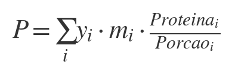
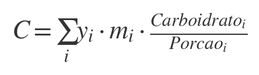
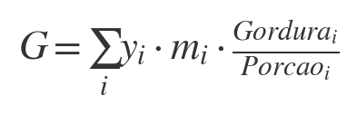
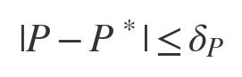
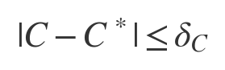
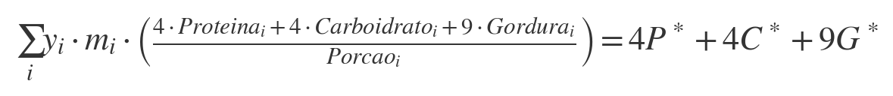
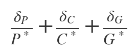

# Otimizador de Cardápios com Ajuste de Macros

Este programa interativo em Python propõe cardápios personalizados otimizando as quantidades de alimentos para atingir metas diárias de **macronutrientes** (proteína, carboidrato e gordura), respeitando as restrições calóricas e de porção dos alimentos escolhidos.

## Funcionalidades

- Leitura de metas de macros a partir de um arquivo JSON (`Macros.json`)
- Seleção manual dos alimentos disponíveis no cardápio a partir de `Alimentos.json`
- Modelagem matemática do problema com programação linear inteira
- Geração de até 5 cardápios distintos com mínimos desvios das metas de macros
- Respeito a restrições individuais de porção mínima e máxima por alimento

---

## Formato dos Arquivos

### `Macros.json`

```json
{
  "Proteina": 130,
  "Carboidrato": 250,
  "Gordura": 60
}
```

### `Alimentos.json`

Lista de dicionários com os campos:

- `Nome`: Nome do alimento
- `Porcao`: Quantidade base para os macros indicados (em gramas ou unidades)
- `Proteina`, `Carboidrato`, `Gordura`: Quantidade por porção
- `Unidade`: `"Gramas"` ou `"Unidades"`
- `Min` (opcional): Consumo mínimo permitido
- `Max` (opcional): Consumo máximo permitido

---

## Modelagem Matemática

### Cálculo dos macronutrientes totais:

  
  


---

### Linearização dos desvios absolutos:

  
  


---

### Restrição Calórica:



---

### Função Objetivo:



---

## Requisitos

- Python 3.7+
- Biblioteca `pulp`

Instalação:

```bash
pip install pulp
```

---

## Execução

```bash
python solver.py
```

O programa abrirá um menu interativo para selecionar alimentos e retornará até 5 cardápios otimizados.

---

## Exemplo de saída

```
--- Cardápio 1 ---
Frango: 200 Gramas
Arroz: 150 Gramas
Abacate: 50 Gramas
Calorias Totais: 2200.0 cal
Macros entregues:
  Proteína: 130.0g (meta: 130g)
  Carboidrato: 250.0g (meta: 250g)
  Gordura: 60.0g (meta: 60g)
Valor do Objetivo (desvios normalizados): 0.0000
```

---

## Licença

MIT License
